# FSAI Cone-Track Path Planning

A local path planner for a Formula Student Driverless style car. Given the car pose `(x, y, yaw)` and
the cones it can see (blue = left boundary, yellow = right boundary), `PathPlanning.generatePath()`
returns a smooth centreline path in world coordinates:

- 7.75–9.5 m long (the assignment allows 5–10 m),
- one point every 0.25 m (the assignment allows up to 0.5 m),
- starting at the car and leaving in the direction the car is facing.

It covers every combination of visible cones: blue and yellow, blue only, yellow only, no cones,
and three or more cones on one side (Part 2).

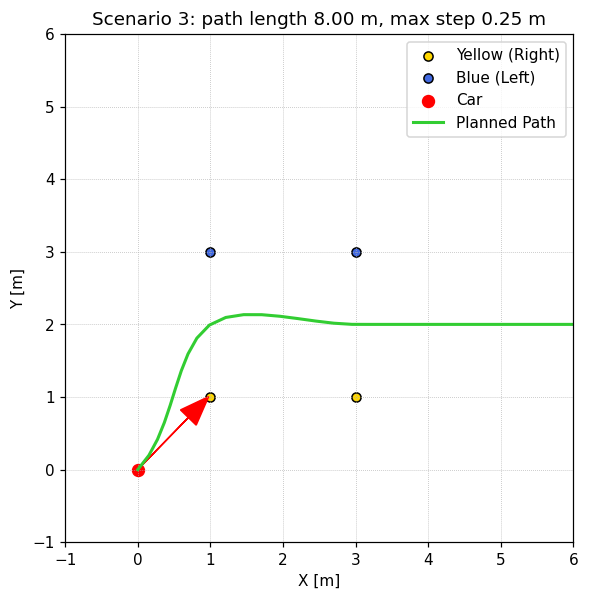

---

## Contents

1. [Quick start](#quick-start)
2. [Part 1: the algorithm](#part-1-the-algorithm)
3. [Part 2: three cones on one side](#part-2-three-cones-on-one-side)
4. [Assumptions](#assumptions)
5. [Results](#results)
6. [Project layout](#project-layout)
7. [Original task](#original-task)

---

## Quick start

### Terminal (macOS / Linux)

```bash
git clone https://github.com/norhaneldhby/PathPlanningTaskARL.git
cd PathPlanningTaskARL
python3 -m venv .venv
source .venv/bin/activate
pip install -r requirements.txt
```

Run one scenario in an interactive Matplotlib window:

```bash
python -m src.run --scenario 21
```

Render every scenario to `screenshots/scenario_<N>.png` without opening any windows. The script also
prints the path length and largest step for each scenario:

```bash
python save_all_scenarios.py
python save_all_scenarios.py 2 21 23   # only some scenarios
```

### PyCharm

1. **File → Open…** and select the `PathPlanningTaskARL` folder.
2. **PyCharm → Settings → Project: PathPlanningTaskARL → Python Interpreter → Add Interpreter →
   Add Local Interpreter → Virtualenv Environment → Existing**, then pick
   `PathPlanningTaskARL/.venv/bin/python`.
3. In the Project tool window, right-click the repository root folder and choose
   **Mark Directory as → Sources Root**. This makes `from src... import ...` resolve.
4. **Run → Edit Configurations… → + → Python**:
   - *Run*: switch the drop-down from "Script" to **Module** and enter `src.run`.
   - *Script parameters*: `--scenario 21`.
   - *Working directory*: the repository root.
5. For the screenshots, right-click `save_all_scenarios.py` and choose **Run 'save_all_scenarios'**.

Requirements: Python 3.9+, `matplotlib`, `numpy` and `scipy` (see `requirements.txt`).

---

## Part 1: the algorithm

The planner runs in three stages:

```
cones ──► 1. centreline waypoints (point + local track direction)
      ──► 2. clean-up (drop waypoints already passed, merge waypoints that are too close)
      ──► 3. clamped cubic spline from the car, extended or truncated, resampled every 0.25 m
```

Stage 1 depends on which cones are visible. Stages 2 and 3 are the same in every case.

### Case A: blue and yellow cones (midpoint pairing)

1. **Provisional track direction.** Take the closest blue/yellow pair. Blue is on the left, so the
   track runs along the `yellow → blue` vector rotated by −90°:
   `d = (v_y, −v_x)` with `v = B − Y`. This uses only the colour convention, not the car yaw, so it
   still works when the car points away from the track.
2. **Order each boundary** by projecting its cones onto `d`, then fit a boundary curve per side to get
   a tangent at every cone. The curve fitting is the same as in Part 2.
3. **Gate proposals.** Every cone proposes a gate with its nearest cone of the other colour. A proposal
   is accepted only if:
   - it is between 0.5 m and 5.0 m wide, and
   - it runs roughly *across* the track: `|cos(gate, boundary tangent)| < 0.8` on both sides. This
     rejects diagonal pairs such as the first yellow cone with the third blue cone.
4. **Midpoints.** Each accepted gate gives a waypoint `M = (B + Y) / 2`. Its direction is that gate's
   track direction.
5. **Unpaired cones** become virtual centreline points. Each one is shifted inward by the *measured*
   half-width: half the median accepted gate width, or the nominal 1.5 m if there are no gates. Blue
   cones shift to the right of their boundary tangent; yellow cones shift to the left.
6. Waypoints are sorted by their progress along `d`.

### Case B: only blue or only yellow cones (virtual boundary offset)

- **One cone.** A single cone gives no boundary direction, so the planner assumes the boundary runs
  parallel to the car heading `θ`:
  - blue (left boundary): shift right by `W/2`: `P = B + 1.5·(sin θ, −cos θ)`
  - yellow (right boundary): shift left by `W/2`: `P = Y + 1.5·(−sin θ, cos θ)`
- **Two or more cones.** This is the Part 2 algorithm below: order the cones, fit a curve, sample it,
  and offset every sample along its own local normal.

### Case C: no cones (dead reckoning)

There are no waypoints. The path is a straight line from the car along `yaw`, 8 m long, with points
every 0.25 m.

### Stages 2 and 3: clean-up and spline

- **Already passed.** A waypoint is dropped when `(P − car) · tangent ≤ 0`, because the car is
  already past it. If that would remove every waypoint, they are all kept.
- **Too close.** A waypoint within 0.3 m of the previous one (or of the car) is merged into it. This
  prevents spline wiggles.
- **Spline.** A `scipy.interpolate.CubicSpline` runs through `[car, waypoint₁, …, waypointₙ]`,
  parameterised by cumulative chord length, which approximates arc length. Both ends are clamped:
  - start derivative = `(cos yaw, sin yaw)`, so the path leaves along the car heading;
  - end derivative = the last waypoint's track direction, so the path leaves the last gate along the
    track and not at an arbitrary angle.
- **Length.** If the spline is shorter than 8 m, it is extended in a straight line along the end
  direction. The join is tangent-continuous. If it is longer than 9.5 m, it is truncated.
- **Resampling.** The curve is evaluated every 2 cm and resampled every 0.25 m of arc length, so every
  step is ≤ 0.25 m.

---

## Part 2: three cones on one side

### Method

When at least two cones of one colour are visible, the boundary is treated as a **curve**:

1. **Order.** Build a greedy nearest-neighbour chain from the car. The first cone is the one closest
   to the car; each next cone is the remaining cone closest to the previous one. When both colours
   are visible, cones are ordered by progress along the gate-derived track direction instead.
2. **Fit.** Fit a parametric interpolating spline `B(t) = (x(t), y(t))` with
   `scipy.interpolate.make_interp_spline`. The parameter `t` is cumulative chord length. The degree
   is `k = min(3, n − 1)`:
   - 2 cones: a straight line,
   - **3 cones: the unique quadratic through them**, which captures one constant-sign curvature
     (a corner),
   - 4 or more cones: a cubic.

   The fit is parametric because `y = f(x)` fails when the boundary turns past vertical.
3. **Normals.** Sample `B(t)` every ~0.5 m. At each sample, compute the unit tangent
   `T = B'(t)/|B'(t)|` and its normal:
   - blue: `n = (T_y, −T_x)` (right of the boundary),
   - yellow: `n = (−T_y, T_x)` (left of the boundary).
4. **Offset.** Centreline samples are `C = B(t) + (W/2)·n` with `W/2 = 1.5 m`. Each sample keeps the
   local tangent `T`, so the final spline leaves the corner along the curve's exit direction.
5. **Mixed case** (for example 3 blue and 1 yellow). Case A pairing runs first. Blue cones that form
   a real gate with the yellow cone give midpoints. The remaining blue cones are offset along their
   fitted-curve normals by the half-width *measured* from that gate.

New scenarios in `src/scenarios.py`:

| Scenario | Cones | What it tests |
|---|---|---|
| `21` | 3 blue, left-hand curve | quadratic boundary fit, offset to the right |
| `22` | 3 yellow, right-hand curve | quadratic boundary fit, offset to the left |
| `23` | 3 blue + 1 yellow | gate midpoint and curve offset combined; diagonal pairs rejected |

| Scenario 21 | Scenario 22 | Scenario 23 |
|---|---|---|
| 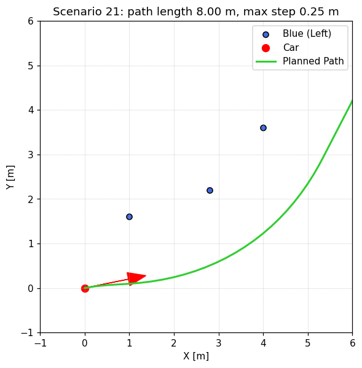 | 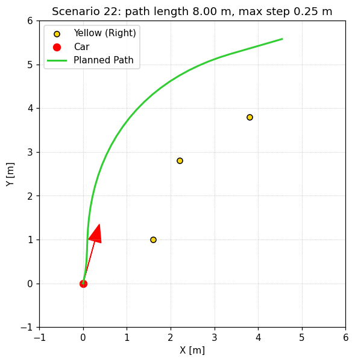 | 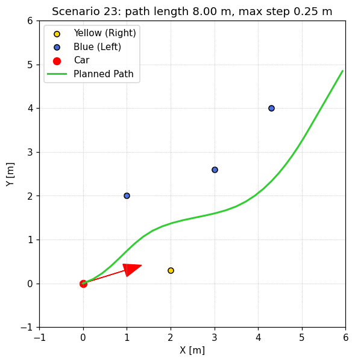 |

### Why this approach

- **It uses all three cones.** With one cone the planner has to assume the boundary is parallel to
  the car. With two it gets a straight boundary. Three cones are the minimum that show the boundary
  is *curving*, and offsetting along the local normal follows the corner instead of cutting it.
- **The result is smooth and tangent-consistent.** The fitted curve gives a well-defined tangent and
  normal everywhere, so the offset path has no corners.
- **It is cheap and deterministic.** There is no optimisation, sampling or search; a handful of cones
  takes well under a millisecond. Real-time FSAI pipelines need that.
- **It degrades gracefully.** The same code handles 2 cones (a line) and 4+ cones (a cubic), so
  Part 1 and Part 2 share one implementation.

### Limitations

- **Hairpins and tight corners.** Offsetting a curve whose radius of curvature is smaller than
  `W/2 = 1.5 m` (on the inside of a hairpin) makes the offset curve fold over and self-intersect,
  producing a cusp or a loop. A real planner would detect `κ·W/2 ≥ 1` and clip the loop, or switch
  to a different method.
- **Sensitive to cone ordering.** The chain is greedy. If cones are unevenly spaced, or a far cone
  sits between two near ones, the order can come out wrong and the fitted curve zig-zags. With both
  colours visible the gate direction resolves this. With one colour only, it relies on the car being
  roughly aligned with the track.
- **No outlier rejection.** The spline *interpolates* every cone. One misplaced or wrongly coloured
  cone, or a false positive from perception, bends the whole boundary. A least-squares or RANSAC fit
  would be more robust once more cones are visible.
- **Occlusion.** Only the visible span of the boundary is fitted. Past the last cone the path
  continues straight along the final tangent; the curve is not extrapolated, because a quadratic
  diverges quickly outside its data.
- **Assumed width.** With one colour only, the centreline is a *guess* that the track is 3 m wide. On
  a narrower or wider section the path is off-centre by the difference.
- **Exact interpolation of three points.** A quadratic through three noisy points can exaggerate or
  understate the curvature. More cones and a smoothing fit would reduce this.

---

## Assumptions

| Assumption | Value / meaning |
|---|---|
| Coordinate frame | Right-handed world frame in metres. `yaw` in radians: 0 along +x, π/2 along +y. All cones and path points are in the world frame. |
| Cone colours | `color == 1` blue is always on the **left** of the direction of travel; `color == 0` yellow is always on the **right**. The planner infers the track direction from this. |
| Track width | Nominal `W = 3.0 m` (`W/2 = 1.5 m`) when it cannot be measured. When a blue/yellow gate is visible, the measured width is used instead. |
| Valid gate | A blue/yellow pair 0.5–5.0 m apart that crosses the track at more than about 37° to the boundary. |
| Single cone | Its boundary is assumed parallel to the current car heading. |
| Cones behind the car | A waypoint whose track direction points away from the car has been passed and is ignored. If every waypoint is behind the car, all of them are kept. |
| Vehicle model | **No kinematic turning limit is enforced.** The path is C¹/C² smooth and starts along the car heading, but in scenarios where the car points far away from the gate (for example 6, 13, 14), the curvature can exceed what a real FS car can steer (minimum radius about 3–4 m). A production planner would check curvature against `tan(δ_max)/L` and replan. |
| Path length | Target 8 m, capped at 9.5 m, so the 5–10 m limit always holds. |
| Path step | 0.25 m arc length between consecutive points, below the 0.5 m limit. |

---

## Results

`python save_all_scenarios.py` prints, for every scenario:

```
[OK ] scenario  1:  33 pts, length  8.00 m, max step 0.25 m -> screenshots/scenario_1.png
...
[OK ] scenario 23:  33 pts, length  8.00 m, max step 0.25 m -> screenshots/scenario_23.png
```

All 23 scenarios meet the length and step constraints. The planner was also fuzz-tested on 30,000
random cone layouts (0–7 cones, random colours and positions, random yaw), including duplicate and
coincident cones. Every run returned a finite path of 5–10 m with steps ≤ 0.5 m.

### Both colours: gate midpoints

| Scenario 2: one gate | Scenario 3: two gates | Scenario 11: gates of different width |
|---|---|---|
| 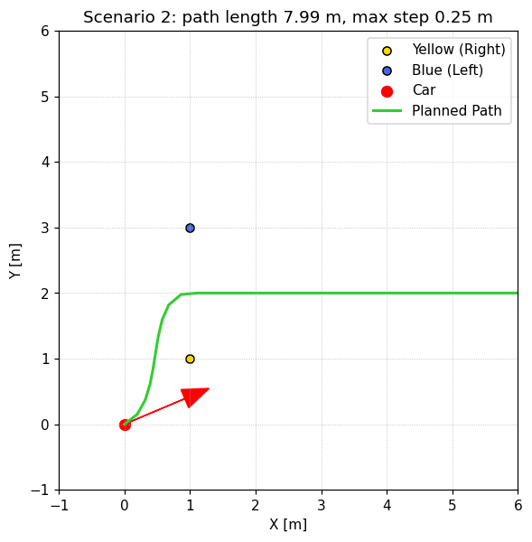 |  | 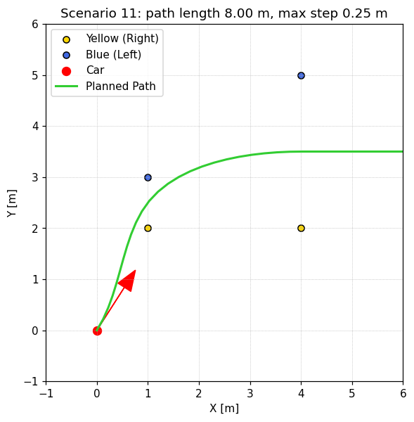 |

| Scenario 7: diagonal pair rejected, measured half-width | Scenario 19: car facing across the track | Scenario 6: car facing away; strong right turn |
|---|---|---|
| 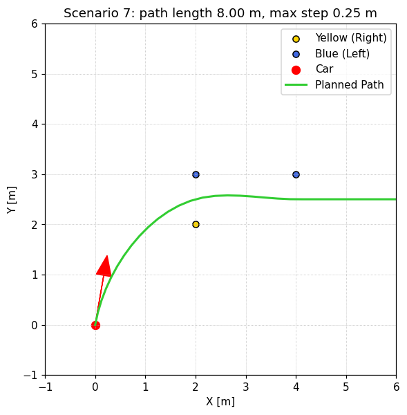 | 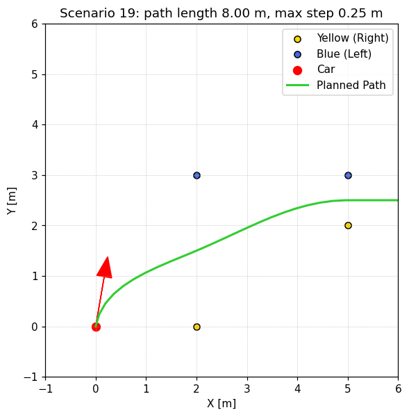 | 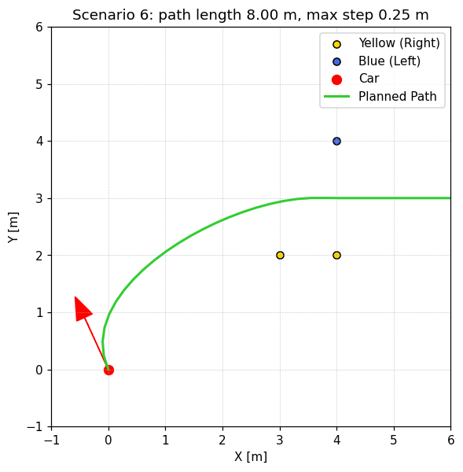 |

### One colour: virtual boundary

| Scenario 5: two yellow | Scenario 8: two blue | Scenario 9: one blue |
|---|---|---|
| 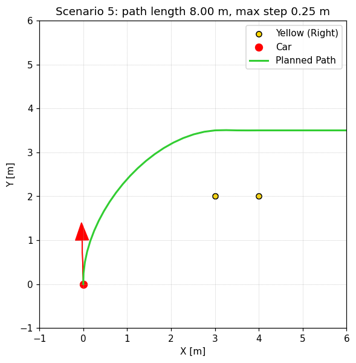 | 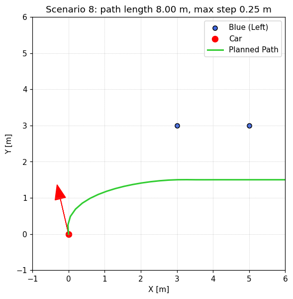 | 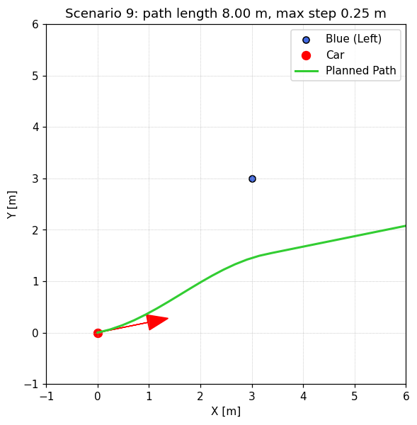 |

### No cones

| Scenario 1: straight dead reckoning |
|---|
| 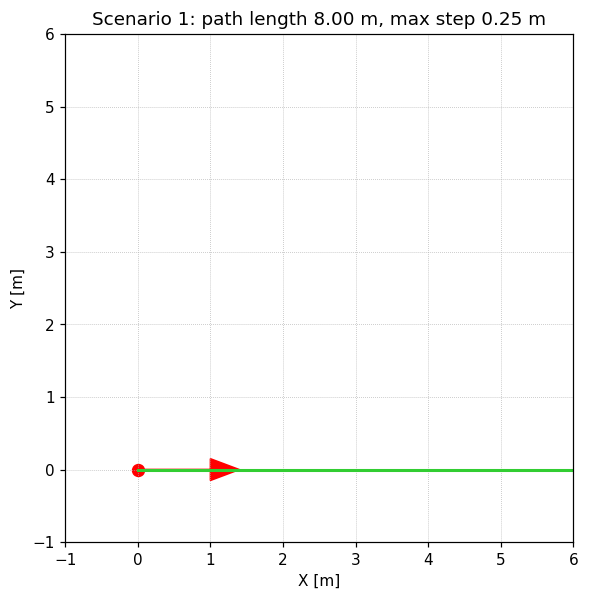 |

### Every scenario

| # | Visible cones | Behaviour |
|---|---|---|
| 1 | none | straight along yaw |
| 2 | 1 B + 1 Y | single gate midpoint, then along the gate direction |
| 3 | 2 B + 2 Y | two gate midpoints |
| 4 | 1 Y | shifted 1.5 m left of the cone, parallel to the heading |
| 5 | 2 Y | line fit, path 1.5 m left of the yellow line |
| 6 | 1 B + 2 Y | two gates share the blue cone; tight right turn because the car faces away |
| 7 | 2 B + 1 Y | diagonal B–Y rejected; far blue offset by the measured 0.5 m half-width |
| 8 | 2 B | line fit, path 1.5 m right of the blue line |
| 9 | 1 B | shifted 1.5 m right of the cone |
| 10 | 1 B + 1 Y | single narrow gate |
| 11 | 2 B + 2 Y | gates of width 1 m and 3 m |
| 12 | 1 Y | shifted left of the cone |
| 13 | 2 Y | vertical yellow line, path at x = 3.5 |
| 14 | 1 B + 2 Y | car faces away from the track; the path turns back to the gates (see the vehicle model assumption) |
| 15 | 2 B + 1 Y | diagonal rejected; virtual waypoint behind the car dropped |
| 16 | 2 B | diagonal blue line, offset to the right |
| 17 | 1 B | shifted right of the cone |
| 18 | 1 B + 1 Y | single diagonal gate |
| 19 | 2 B + 2 Y | two gates, car facing across the track |
| 20 | 1 Y | shifted left of the cone (leaves the plot window on the left) |
| 21 | 3 B | **Part 2**: quadratic fit, left-hand curve |
| 22 | 3 Y | **Part 2**: quadratic fit, right-hand curve |
| 23 | 3 B + 1 Y | **Part 2**: mixed gate and curve offset |

---

## Project layout

```
PathPlanningTaskARL/
├── src/
│   ├── models.py          # Cone, CarPose, Path2D
│   ├── path_planning.py   # PathPlanning.generatePath()  ← the solution
│   ├── scenarios.py       # scenarios 1–20 + Part 2 scenarios 21–23
│   ├── tester.py          # Matplotlib visualiser (PathTester)
│   └── run.py             # CLI: python -m src.run --scenario N
├── save_all_scenarios.py  # headless batch renderer → screenshots/
├── screenshots/           # scenario_1.png … scenario_23.png
├── requirements.txt
└── README.md
```

Helpers in `src/path_planning.py`:

| Helper | Purpose |
|---|---|
| `_order_by_distance` | greedy nearest-neighbour cone chain starting at the car |
| `_order_along` | sort cones by progress along a direction |
| `_fit_boundary` | parametric line / quadratic / cubic spline through ordered cones |
| `_boundary_tangents` | unit tangent at every cone |
| `_left_normal` / `_right_normal` | normal vectors used for inward offsets |
| `_gate_direction` | track direction through a blue/yellow gate |
| `_is_gate` | width and orientation test for a blue/yellow pair |
| `_waypoints_from_both_sides` | Case A: midpoint pairing plus unpaired-cone offsets |
| `_waypoints_from_one_side` | Case B and Part 2: virtual boundary offset |
| `_clean_waypoints` | drops passed waypoints and merges close ones |
| `_build_path` | clamped cubic spline, heading extension, length limits |
| `_resample` | uniform 0.25 m arc-length resampling |

---

## Original task

**Part 1.** Given up to two cones per side (`color == 0` yellow on the right, `color == 1` blue on the
left) and the car pose, return path points `(x, y)` in world coordinates that form a drivable route
between the boundaries. The path should be 5–10 m long with a step of at most 0.5 m. Implement it in
`src/path_planning.py → PathPlanning.generatePath()`.

**Part 2.** What if three cones are given on one side of the track? Implement an approach that uses
them, add test scenarios to `src/scenarios.py`, and explain why the approach was chosen and what its
limitations are.
